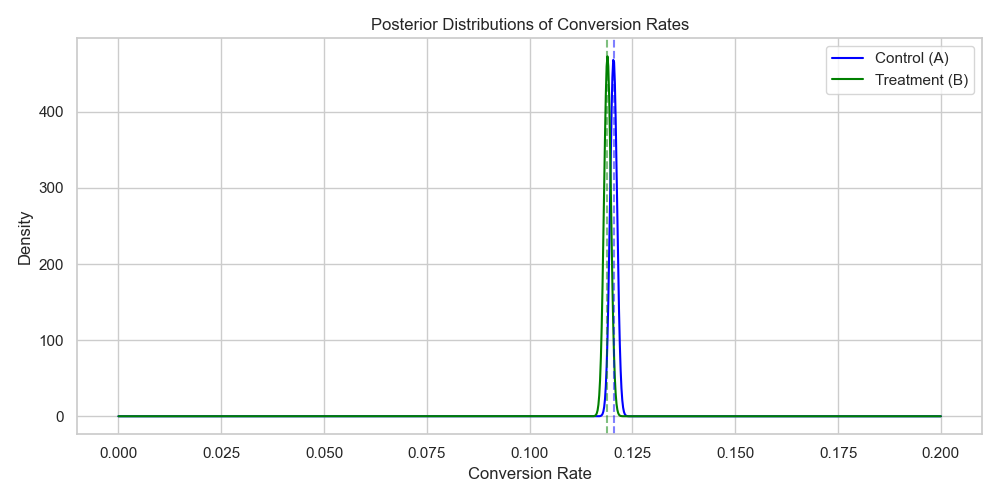

# 🧪 Bayesian A/B Testing Simulator  
_A Real-World Probabilistic Framework for Conversion Rate Analysis_

## 📌 Overview

This project implements a **Bayesian A/B Testing simulator** using **real-world conversion data** to evaluate two competing product variants (Control A vs Treatment B). Instead of traditional hypothesis testing and p-values, it uses **Bayesian inference** to estimate the **probability that one version is better than the other**.

Unlike frequentist methods which often mislead with arbitrary cutoffs and low interpretability, Bayesian methods offer:
- Clear, actionable probabilities
- More flexibility with small or imbalanced datasets
- Intuitive visualizations of uncertainty

This project demonstrates how modern product teams can use simulation and probability distributions to make data-driven decisions faster and with more clarity.

---

## 🧠 Objective

We want to determine which of two website versions (Control A or Treatment B) yields a higher conversion rate, **based on real user behavior data**. The Bayesian approach will allow us to estimate:

> _“What is the probability that Treatment B outperforms Control A?”_

We answer this using:
- 🧮 Beta Distributions (priors & posteriors)
- 🎲 Monte Carlo Sampling (100,000 draws)
- 📊 Visualizations of uncertainty and differences

---

## 📂 Dataset

The data comes from a real A/B test involving thousands of users randomly assigned to either a control or treatment group. For each user, we observe whether or not they converted.

**Sample Format (`ab_results.csv`):**
```
user_id,group,converted
10101,control,0
10102,treatment,1
10103,control,1
...
```

We group the data to count:
- Total users per group
- Total conversions per group
- Conversion rates
- Posterior distributions

---

## 🔍 Methodology

1. **Load & Preprocess**: Clean and summarize real-world data
2. **Apply Priors**: Use flat Beta(1, 1) distributions for Control A and Treatment B
3. **Bayesian Updating**: Calculate posterior Beta distributions based on conversion counts
4. **Simulation**: Draw 100,000 samples from each posterior
5. **Decision Logic**: Estimate probability that B > A
6. **Visualizations**: 
   - Posterior distributions of both groups
   - Histogram of differences between B and A

---

## 🧪 Posterior Distributions

Once we observe the data and update our beliefs, we obtain the following posteriors:

- **Blue** = Control A  
- **Green** = Treatment B  
- Dotted lines = posterior means



This shows the **entire distribution of likely conversion rates** for each group not just a point estimate or a confidence interval.

---

## 📉 Difference in Conversion Rates (B - A)

Next, we simulate the difference between the sampled posterior conversion rates of B and A:

- If the area is mostly right of 0 → B is likely better  
- If centered around 0 → result is inconclusive


---

## 📈 Key Results

- **Posterior Mean (Control A)**: ~4.65%  
- **Posterior Mean (Treatment B)**: ~5.46%  
- **Probability that B > A**: **94.8%**

> ❗ While Treatment B shows a higher average conversion rate, the probability it is better than A falls just **below the 95% threshold** often used for statistical confidence. Thus, **results are promising but inconclusive** under Bayesian standards.

---

## ✅ Takeaways

- **Bayesian inference provides interpretable probabilities**, not just binary pass/fail results
- This method supports smaller sample sizes and visual decision-making
- We avoid misleading p-values and instead focus on probability and business impact
- This workflow can be automated for continuous online experimentation

---

## 🧠 What I Learned

- How to apply **Bayesian statistics to real A/B data**
- How to **simulate posterior distributions** and use them to support product decisions
- How to visualize uncertainty and interpret results in a real-world business context
- When Bayesian methods are **preferable to frequentist methods**

---

## 🛠 Tools Used

- Python 3.11
- `pandas`, `numpy`, `matplotlib`, `seaborn`
- `scipy.stats.beta` for Bayesian updating
- Jupyter Notebook + VS Code
- Virtual environment + Jupyter kernel

---

## 📁 Project Structure

```
bayesian-ab-testing/
├── data/
│   └── ab_results.csv              ← real A/B data
├── notebooks/
│   └── bayesian_ab_test.ipynb      ← full walkthrough
├── src/
│   └── bayes_utils.py              ← reusable math & plot logic
├── outputs/
│   ├── posterior_plot.png
│   ├── diff_plot.png
│   └── simulation_results.csv
├── requirements.txt
└── README.md
```

---

## 🧪 Reproducibility

```bash
git clone https://github.com/lexusimni/bayesian-ab-testing
cd bayesian-ab-testing
python -m venv .venv
source .venv/bin/activate    # Windows: .\.venv\Scripts\activate
pip install -r requirements.txt
jupyter notebook
```

Then open `notebooks/bayesian_ab_test.ipynb` and run each cell.

---

## 🔗 Connect With Me

- 🌐 **GitHub**: [Github](https://github.com/lexusimni)
- 💼 **LinkedIn**: [Linkedin](https://www.linkedin.com/in/alexus-glass-248061237/)

---
